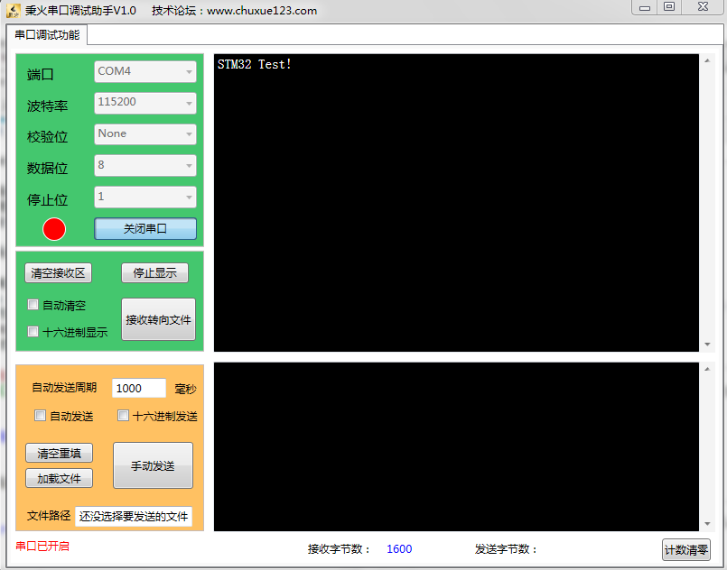

# 一、实验内容: 串口通信(USART)
配置串口，通过串口从STM32开发板往计算机发送字节信息.

# 二、实验目的:
将`printf()`、`scanf()`等C库函数重定向到串口中，便于程序调试. 该工程将用作今后的模板框架.

# 三、实验器材:
## 硬件:
- 开发板: F103指南者 秉火STM32
- 硬件连接:
	- JLINK连线一根，用作程序下载
	- 杜邦线若干，用作连接STM32开发板的引脚
	- USB连线一根，用作串口通信
## 软件
- 计算机操作系统: windows7 32-bit 旗舰版
- 驱动程序:
	- USB转串口驱动CH340
	- J-Link ARM v4.60a
- 开发与测试的软件
	- IDE: Keil MDK V5.12.0.0
	- 串口调试程序，本例用的是`秉火串口调试助手V1.0.exe`

## 四、关键实验过程
- 本例使用`端口4-USART4`发送数据，需使用杜邦线连接STM32的引脚，如图:

## 实验结果
编译链接无误后通过J-Link将程序下载到开发板，按下`RESET`键，结果如下:

