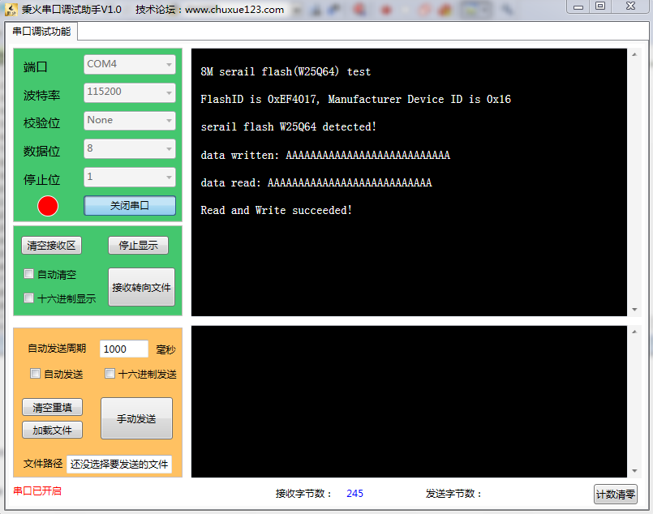

# 一、实验内容: SPI-读写串行FLASH
读取 Flash 的 ID 信息，写入数据，并读取出来校验，通过串口分别打印写入与读取出来的数据，输出测试结果.

# 二、实验目的
使用 NRF 进行无线通信时需要用到 SPI 接口，需要预先测试 SPI 接口.

# 三、实验器材:
## 硬件:
- 开发板: F103指南者 秉火STM32
- 硬件连接:
	- JLINK连线一根，用作程序下载
	- 杜邦线若干，用作连接STM32开发板的引脚
	- USB连线一根，用作串口通信
## 软件
- 计算机操作系统: windows7 32-bit 旗舰版
- 驱动程序:
	- USB转串口驱动CH340
	- J-Link ARM v4.60a
- 开发与测试的软件
	- IDE: Keil MDK V5.12.0.0
	- 串口调试程序，本例用的是`秉火串口调试助手V1.0.exe`

## 四、关键实验过程
本例使用串口1-USART1, 需要将 STM32 开发板的`RXD-A9`、`TXD-A10`用跳帽连接

## 实验结果

